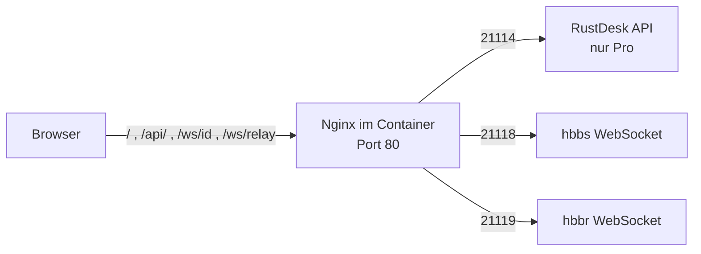

# Funktionsanalyse: docker-rustdesk-web-client

Diese Analyse beschreibt, was dieses Repository tut, wie es aufgebaut ist und
welche Voraussetzungen erfüllt sein müssen, damit es baut und läuft.

Stand: Commit-Basis `main` mit den Änderungen des Branches
`claude/translate-instructions-german-5c5njo`.

## 1. Zweck in einem Satz

Das Repository baut aus dem Quellcode des RustDesk-Web-Clients ein
lauffähiges Docker-Image und liefert die fertige Weboberfläche aus — es
enthält selbst keinen Anwendungscode, sondern ist reine Build- und
Auslieferungs-Infrastruktur.

Wichtig zur Abgrenzung: Das Repository baut **nicht** den RustDesk-Server.
Der Server (`hbbs`/`hbbr`) muss separat betrieben werden und ist eine
Voraussetzung, keine Beigabe.

## 2. Was hier tatsächlich passiert

RustDesk ist eine Open-Source-Fernwartungslösung. Der Web-Client ist eine in
Flutter geschriebene Anwendung, die nach WebAssembly kompiliert wird und im
Browser läuft. Es gibt kein offizielles fertiges Docker-Image dafür, deshalb
kompiliert dieses Repository den Client selbst aus dem Quellcode und packt das
Ergebnis in ein Image.

Der Build ist aufwendig, weil drei Toolchains beteiligt sind: Node/Yarn für den
TypeScript-Teil, Rust für den WebAssembly-Teil und Flutter für die Oberfläche.

## 3. Zwei Varianten

Das Repository pflegt zwei voneinander unabhängige Images mit
unterschiedlichem Architekturansatz.

| | Aktuell (`Dockerfile`) | Alt (`v1/Dockerfile`) |
|---|---|---|
| Interner Port | `80` | `5000` |
| Webserver | Nginx | `python3 -m http.server` |
| Backend-Anbindung | Nginx-Reverse-Proxy | direkt aus dem Browser |
| Konfiguration | `BACKEND_HOST`, `PROTO` | Server-Adressen in den `localStorage` |
| Quelle des Clients | `MonsieurBiche/rustdesk-web-client` | `pmietlicki/rustdesk-web-client` |
| Flutter | 3.22.1 | 3.7.9 |
| Läuft als | Nginx-Standard: Master als root, Worker als `nginx` | uid 10001 |

Der entscheidende Unterschied ist nicht der Webserver, sondern **wer mit dem
RustDesk-Server spricht**.

### Aktuelle Variante: Nginx als Vermittler

Der Browser kennt die Adresse des RustDesk-Servers nicht. Er spricht
ausschließlich den Origin an, unter dem die Seite ausgeliefert wird. Nginx
nimmt diese Anfragen entgegen und leitet sie an das Backend weiter:

Die Weiterleitungen stehen in `docker/nginx/default.conf.template`:

| Pfad | Backend-Port | Dienst |
|---|---|---|
| `/api/` | `21114` | HTTP-API / Web-Konsole |
| `/ws/id` | `21118` | `hbbs`, WebSocket für Web-Clients |
| `/ws/relay` | `21119` | `hbbr`, WebSocket für Web-Clients |

Daraus folgt: Es genügt, dass **Nginx** das Backend erreicht. Der Browser
braucht keine direkte Sicht auf die RustDesk-Ports. Genau deshalb reicht die
Angabe von `BACKEND_HOST` — diese Adresse wird nirgends in den Client
geschrieben.

### Variante v1: der Browser spricht direkt

Hier gibt es keinen Proxy. Beim Containerstart erzeugt
`v1/server/generate_env_config.py` eine Datei `env-config.js`, die
`server.sh` in die `index.html` einhängt. Sie schreibt vier Werte in den
`localStorage` des Browsers:

| `localStorage`-Schlüssel | Umgebungsvariable | Standard |
|---|---|---|
| `custom-rendezvous-server` | `CUSTOM_RENDEZVOUS_SERVER` | leer |
| `relay-server` | `RELAY_SERVER` | leer |
| `api-server` | `API_SERVER` | `api.rustdesk.com` |
| `key` | `KEY` | leer |

Die Werte laufen durch `json.dumps()`, bevor sie in die JavaScript-Datei
geschrieben werden. Das ist kein Schönheitsdetail: Ohne diese Kodierung könnte
ein Anführungszeichen oder ein Zeilenumbruch in einem Schlüssel die erzeugte
Datei zerstören oder Code einschleusen.

Konsequenz für den Betrieb: Bei v1 muss der **Browser jedes Endanwenders** die
RustDesk-Server direkt erreichen können, nicht nur der Container.

## 4. Die Build-Pipeline im Detail

Das aktuelle `Dockerfile` hat drei Stufen.

**Stufe 1 — `js-build` (Node 20)**
Klont den Client aus GitHub, festgenagelt über `RUSTDESK_EXPECTED_COMMIT`.
Patcht die Vite-Konfiguration um ein `manualChunks`, korrigiert einen
`appBarActions`-Parameter im Dart-Code, installiert Yarn-Abhängigkeiten und
baut den TypeScript-Teil.

Hier passieren zwei Dinge, die man kennen sollte:

- Bei `ENABLE_WSS=true` (Standard) werden in allen `.ts`/`.js`-Dateien alle
  Vorkommen von `ws://` durch `wss://` ersetzt. Das ist eine
  **Build-Zeit**-Entscheidung, keine Laufzeit-Option.
- In die `index.html` wird ein Inline-`<script>` injiziert, das beim Laden den
  `localStorage` aufräumt: leere Einträge werden entfernt, kaputtes JSON auf
  `[]` bzw. `{}` zurückgesetzt und fehlende Standardschlüssel angelegt. Das
  verhindert, dass ein einmal beschädigter `localStorage` den Client dauerhaft
  unbrauchbar macht.

**Stufe 2 — `flutter-build` (Debian Bookworm)**
Installiert die Rust-Toolchain samt Ziel `wasm32-unknown-unknown` und das
Flutter-SDK, übernimmt die Quellen aus Stufe 1, entpackt `web_deps.tar.gz` und
baut mit `flutter build web --release`.

`RUSTFLAGS='--cfg getrandom_backend="js"'` ist dabei nicht optional — ohne
diese Angabe findet `getrandom` im WebAssembly-Ziel keine Entropiequelle.

**Stufe 3 — `final` (nginx:alpine)**
Kopiert nur noch das gebaute Web-Verzeichnis, die Nginx-Vorlage und das
Entrypoint-Skript. Die Toolchains bleiben zurück, das Laufzeit-Image ist
entsprechend klein.

### Was `web_deps.tar.gz` ist

Das mitgelieferte Archiv enthält **ogv.js 1.8.6** — WebAssembly-Decoder für
VP8, VP9, AV1, Opus und Vorbis. Der Web-Client braucht sie, um die
Videoströme im Browser zu dekodieren.

Das Archiv liegt bewusst im Repository und wird aus dem aktuellen Checkout
gelesen. Frühere Fassungen luden es zur Build-Zeit aus `main` nach — dadurch
konnte der Build eines bestimmten Commits stillschweigend die Abhängigkeiten
einer anderen Revision verwenden. Der reproduzierbare Weg ist der jetzige.

### Reproduzierbarkeit

Der Build ist an mehreren Stellen festgenagelt:

- alle Basis-Images per SHA256-Digest,
- der Client-Commit über `RUSTDESK_EXPECTED_COMMIT`,
- Flutter- und Rust-Version über Build-Argumente,
- die Web-Abhängigkeiten als eingechecktes Archiv.

`RUSTDESK_EXPECTED_COMMIT` greift allerdings nur, wenn Repository **und**
Branch auf den Standardwerten stehen. Wer `RUSTDESK_REPO` oder `RUSTDESK_TAG`
ändert, baut ungepinnt und muss `RUSTDESK_COMMIT` selbst setzen.

## 5. Laufzeitverhalten

Das Entrypoint-Skript `docker/nginx/entrypoint.sh` validiert vor dem Start:

- `PROTO` muss `http` oder `https` sein, sonst Abbruch mit Exit-Code 64.
- `BACKEND_HOST` muss gegen `^([A-Za-z0-9._-]+|\[[0-9A-Fa-f:]+\])$` passen —
  also ein Hostname, eine IPv4 oder eine IPv6 in eckigen Klammern. Ein Schema
  oder ein Port führt zum Abbruch.

Anschließend werden die Platzhalter in die Nginx-Konfiguration eingesetzt
(die Ersetzungswerte werden zuvor für `sed` maskiert), `nginx -t` prüft die
erzeugte Konfiguration, dann startet Nginx im Vordergrund.

`PROTO` beschreibt ausschließlich die Verbindung **zwischen Nginx und dem
Backend**. Nach außen spricht der Container immer unverschlüsseltes HTTP auf
Port 80.

## 6. Voraussetzungen

### 6.1 Zum Bauen

| Voraussetzung | Details |
|---|---|
| Docker mit BuildKit | `# syntax=docker/dockerfile:1.7` und `--mount=type=cache` setzen BuildKit zwingend voraus |
| Docker Compose v2 | für `docker compose`; `build.sh` fällt auf `docker-compose` zurück |
| Ausgehender Netzzugang | github.com (Client, Flutter-SDK, Submodule), `sh.rustup.rs`, Debian-/Alpine-Paketquellen, npm-/Yarn-Registry, `pub.dev` |
| Freier Speicherplatz | `build.sh` warnt unterhalb von 4 GiB; das ist eine Untergrenze. Flutter-SDK, Rust-Toolchain, `node_modules` und die Zwischenstufen zusammen brauchen realistisch deutlich mehr — planen Sie großzügig |
| Zeit | Der Build kompiliert Rust nach WebAssembly und Flutter für Web. Rechnen Sie mit einem langen ersten Durchlauf; die BuildKit-Caches für Cargo, Yarn und Flutter beschleunigen Folgeläufe erheblich |
| Architektur | Die Basis-Images sind per Digest auf ihre Plattform festgelegt. Auf ARM ist ein Build nicht getestet |

Für `build.sh` zusätzlich: `bash`, `curl` (für den Health-Check), `df` und
`awk`.

### 6.2 Zum Betrieb

**Ein laufender RustDesk-Server ist Pflicht.** Ohne ihn lädt die Oberfläche,
aber es kommt keine Verbindung zustande.

Der Server muss vom Container aus erreichbar sein, und zwar auf:

| Port | Dienst | Verfügbarkeit |
|---|---|---|
| `21118/tcp` | `hbbs`, WebSocket für Web-Clients | OSS und Pro |
| `21119/tcp` | `hbbr`, WebSocket für Web-Clients | OSS und Pro |
| `21114/tcp` | HTTP-API / Web-Konsole | **nur RustDesk Server Pro** |

Die Ports 21118 und 21119 sind es, die den Web-Client überhaupt erst möglich
machen — sie sind in der OSS-Ausgabe vorhanden, lassen sich dort aber
deaktivieren. Sie müssen aktiv sein.

Port 21114 gehört zur API beziehungsweise Web-Konsole und existiert nur in
RustDesk Server Pro. Mit der OSS-Ausgabe läuft die Route `/api/` deshalb ins
Leere. Das ist kein Fehler dieses Repositories: Das mitgelieferte
Kubernetes-Beispiel für die OSS-Ausgabe routet konsequenterweise nur `/ws/id`
und `/ws/relay` und lässt `/api/` weg.

Weitere Betriebsvoraussetzungen:

- **Namensauflösung beim Start.** Nginx löst die Hostnamen aus den
  `upstream`-Blöcken beim Laden der Konfiguration auf. Ist `BACKEND_HOST` in
  diesem Moment nicht auflösbar, schlägt schon `nginx -t` fehl und der
  Container startet nicht. Ein Backend, das erst später hochkommt, braucht
  also eine Startreihenfolge oder eine Restart-Policy.
- **TLS-Terminierung davor.** Siehe Abschnitt 7.
- **Ein Reverse-Proxy oder Ingress**, der WebSocket-Upgrades durchreicht und
  großzügige Timeouts setzt. Das Kubernetes-Beispiel zeigt es mit
  `proxy-read-timeout: 3600` und dem `Upgrade`/`Connection`-Snippet.

### 6.3 Im Browser

Moderner Browser mit WebAssembly-Unterstützung. Der Client wird nach
WebAssembly kompiliert und nutzt WASM-Videodecoder — ohne diese Grundlage
läuft nichts.

Bei Variante v1 kommt hinzu, dass der Browser die konfigurierten Rendezvous-,
Relay- und API-Server selbst erreichen können muss.

## 7. Stolperfallen

Diese Punkte ergeben sich aus dem Code und sind im Betrieb erfahrungsgemäß die
häufigsten Ursachen für „lädt, funktioniert aber nicht".

**`ENABLE_WSS=true` erzwingt HTTPS.** Der Standardwert lässt den Build alle
`ws://` durch `wss://` ersetzen. Der Client versucht dann verschlüsselte
WebSocket-Verbindungen — der Container selbst spricht aber nur HTTP auf Port
80. Ohne vorgeschaltete TLS-Terminierung schlagen die Verbindungen fehl,
obwohl die Oberfläche einwandfrei lädt. Ein reiner Test über
`http://localhost:5000` zeigt deshalb die Seite, aber keine funktionierende
Verbindung. Wer bewusst ohne TLS testen will, muss mit `ENABLE_WSS=false`
neu bauen.

**`BACKEND_HOST=127.0.0.1` ist selten richtig.** Der Standardwert zeigt auf
den Web-Container selbst, nicht auf den Host und nicht auf den RustDesk-Server.
In fast allen Aufbauten muss hier der Servicename oder die Adresse des
RustDesk-Servers stehen.

**`BACKEND_HOST` verträgt kein Schema und keinen Port.** Die Validierung
lehnt `https://host` und `host:21116` ab. IPv6 gehört in eckige Klammern.

**Die Ports 21115, 21116 und 21117 fehlen bewusst.** Der Proxy leitet nur die
drei WebSocket- und API-Ports weiter. Die klassischen Ports für NAT-Test,
ID-Registrierung und Relay werden von den nativen Clients benutzt, nicht vom
Web-Client. Wer den Server ohnehin betreibt, braucht sie weiterhin — aber
nicht für dieses Image.

**Variante v1 nutzt `python3 -m http.server`.** Das ist der
Entwicklungs-Webserver der Python-Standardbibliothek: einfädig, ohne
Härtung, ausdrücklich nicht für den Produktivbetrieb gedacht. Für v1 gilt
deshalb noch stärker als für die aktuelle Variante, dass ein Reverse-Proxy
davorgehört. Wo es geht, ist die aktuelle Variante vorzuziehen.

**Der Standard `API_SERVER=api.rustdesk.com` zeigt nach außen.** Wer v1 ohne
gesetzten `API_SERVER` betreibt, spricht den öffentlichen Dienst von RustDesk
an, nicht die eigene Installation.

## 8. Konfigurationsreferenz

### Build-Argumente und `.env` (aktuelle Variante)

| Variable | Standard | Wirkung |
|---|---|---|
| `WEB_PORT` | `5000` | Port auf dem Host |
| `BACKEND_HOST` | `127.0.0.1` | Ziel der Proxy-Routen |
| `PROTO` | `http` | Protokoll Nginx → Backend |
| `RUSTDESK_REPO` | `MonsieurBiche/rustdesk-web-client` | Quell-Repository |
| `RUSTDESK_TAG` | `fix-build` | Branch oder Tag |
| `RUSTDESK_COMMIT` | leer | expliziter SHA, hat Vorrang |
| `RUSTDESK_EXPECTED_COMMIT` | `525b5e5…` | Pin, greift nur bei Standard-Repo und -Branch |
| `ENABLE_WSS` | `true` | `ws://` → `wss://` zur Build-Zeit |
| `FLUTTER_VERSION` | `3.22.1` | Flutter-SDK |
| `RUST_VERSION` | `1.97.0` | Rust-Toolchain |
| `IMAGE_NAME`, `CONTAINER_NAME` | `rustdesk-web-client` | lokale Namen |

Variablen aus der aufrufenden Umgebung haben Vorrang vor `.env`. `build.sh`
liest `.env` zeilenweise ein und führt sie **nicht** als Shell-Code aus —
ungültige Zeilen führen zum Abbruch mit Exit-Code 64.

### Umgebungsvariablen (Variante v1)

`CUSTOM_RENDEZVOUS_SERVER`, `RELAY_SERVER`, `API_SERVER`, `KEY`, `PORT` —
siehe Tabelle in Abschnitt 3.

## 9. Qualitätssicherung

Die CI (`.github/workflows/ci.yml`) läuft bei Push auf `main`, bei jedem Pull
Request und manuell. Sie besteht aus zwei Jobs:

`validate` prüft die Shell-Skripte mit `bash -n`, `sh -n` und ShellCheck,
führt die Python-Unittests und die beiden Shell-Testsuites aus, validiert die
Compose-Datei, lintet beide Dockerfiles mit Hadolint und kontrolliert, dass
`web_deps.tar.gz` lesbar ist.

`build-and-smoke-test` baut anschließend beide Images in einer Matrix,
startet sie, wartet auf `healthy` und ruft die Startseite ab.

Lokal entspricht dem der Block „Validierung" in der README.

Die Testabdeckung ist auf die Konfigurationslogik ausgerichtet, nicht auf den
Client: `tests/test_generate_env_config.py` prüft die JSON-Kodierung der
v1-Werte, `tests/test_nginx_entrypoint.sh` prüft Platzhalter-Ersetzung und
Eingabevalidierung inklusive IPv6, `tests/test_build_script.sh` prüft das
Einlesen von `.env` und die Vorrangregel der Umgebung.

**Hinweis zu diesem Fork:** In `fardem/docker-rustdesk-web-client` ist GitHub
Actions derzeit nicht aktiviert — es sind null Workflows registriert, die
vorhandene `ci.yml` wird also nicht ausgeführt. Zu aktivieren unter
*Settings → Actions → General*.

## 10. Einordnung

Stärken dieses Aufbaus: durchgängig gepinnte Basis-Images und Quell-Commits,
ein schlankes Laufzeit-Image ohne Build-Werkzeuge, Eingabevalidierung vor dem
Start statt Fehlersuche danach, JSON-Kodierung statt roher
String-Interpolation in generiertem JavaScript, und eine CI, die die Images
nicht nur baut, sondern auch startet.

Die wesentliche Einschränkung liegt außerhalb des Repositories: Der Web-Client
hängt an einem Fork (`MonsieurBiche/rustdesk-web-client`, Branch `fix-build`),
weil der Build aus dem Hauptprojekt heraus nicht ohne Weiteres funktioniert.
Diese Abhängigkeit sollte man im Blick behalten.

## Quellen

- [RustDesk Documentation — Self-host](https://rustdesk.com/docs/en/self-host/)
- [RustDesk Documentation — RustDesk Server Pro](https://rustdesk.com/docs/en/self-host/rustdesk-server-pro/)
- [rustdesk/rustdesk-server — Discussion #644: On the 21114 port with RustDesk OSS server](https://github.com/rustdesk/rustdesk-server/discussions/644)
